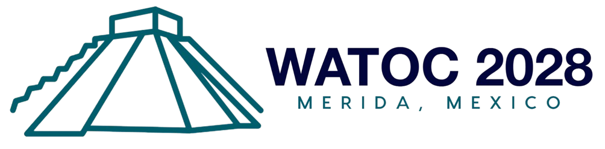

<h1 align="center">
    
</h1>

<h1 align="center">
  <a href="#"> WATOC 2028 (Frontend) </a>
</h1>

<h3 align="center">We help you build your project in React!</h3>

  
  
  
  

## About

WATOC 2028 — Mérida, Yucatán

---

## Tech Stack

The following tools were used in the construction of the project:

#### **Platform** ([React](https://reactjs.org/) + [TypeScript](https://www.typescriptlang.org/))

- **[React Router Dom](https://github.com/ReactTraining/react-router/tree/master/packages/react-router-dom)**
- **[React Icons](https://react-icons.github.io/react-icons/)**
- **[Axios](https://github.com/axios/axios)**
- **[Leaflet](https://react-leaflet.js.org/en/)**
- **[React Leaflet](https://react-leaflet.js.org/)**
- **[React Redux](https://github.com/reduxjs/react-redux)**
- **[AntDesign](https://ant.design/)**
- **[react-device-detect](https://github.com/duskload/react-device-detect)**
- **[moment.js](https://momentjs.com/)**
- **[Bootstrap](https://getbootstrap.com/)**
- **[sass](https://github.com/sass/dart-sass)**
- **[Styled Components](https://github.com/styled-components/styled-components)**

> See the file [package.json](https://github.com/evelinsteiger/README-template/blob/master/package.json)

#### **Utils**

- API: **[IBGE API](https://servicodados.ibge.gov.br/api/docs/localidades?versao=1)** → **[API de UFs](https://servicodados.ibge.gov.br/api/docs/localidades?versao=1#api-UFs-estadosGet)**, **[API de Municípios](https://servicodados.ibge.gov.br/api/docs/localidades?versao=1#api-Municipios-estadosUFMunicipiosGet)**
- Maps: **[Leaflet](https://react-leaflet.js.org/en/)**
- Editor: **[Visual Studio Code](https://code.visualstudio.com/)**
- Icons: **[Feather Icons](https://feathericons.com/)**, **[Font Awesome](https://fontawesome.com/)**
- Fonts: **[Ubuntu](https://fonts.google.com/specimen/Ubuntu)**, **[Roboto](https://fonts.google.com/specimen/Roboto)**

---

## Learn More

This project was created and bootstrapped with [Create React App](https://github.com/facebook/create-react-app).

You can learn more in the [Create React App documentation](https://facebook.github.io/create-react-app/docs/getting-started).

To learn React, check out the [React documentation](https://reactjs.org/).
